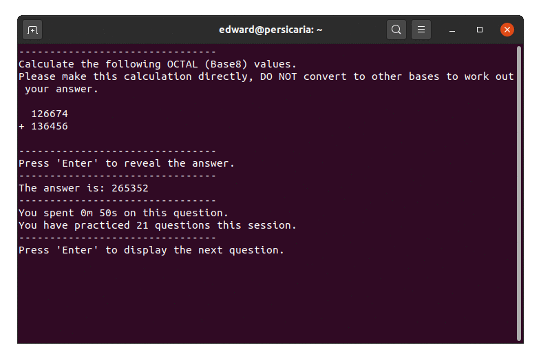

# BaseTrainer
BaseTrainer is a simple terminal application written in Python 3 initially written to help with studying various Digital Technologies concepts taught at University.

When run, the program will endlessly generate random mathematical questions from a series of categories in order to test the user and allow them to become familiar with the concepts explored through repeated practice. The program will also display the amount of time spent on a given question upon revealing its answer, as well as how many questions have been practiced in that session.

# Questions
The types of questions that can be generated include the following:

- Conversion of a value between 2 base systems (Hexadecimal, Decimal, Octal and Binary).
    - Additional random prompts specifying a direct or indirect conversion approach.
- Direct addition of 2 numbers in a given base.
- Representation of a binary fraction as its decimal number or vice-versa.
- Calculating Frame Buffer memory requirements of a given display size and color depth in either bits or bytes.
- Calculating the Dot Frequency of a given Display Size and Refresh Rate.
- Representing a decimal number in binary using 2's Complement.
- Performing 'Bus Stop' division.
- Determining the mode(s), median, mean, or range of a given data set.

# Examples (gif)


# Usage / Requirements
- Python 3

```python3 basetrainer.py```

Simply run the script inside a terminal like normal - BaseTrainer was written with <b>ease of distribution</b> among other students as a priority. Therefore, the entire program is contained within a single file, and does not rely on any external packages to function.

Questions will begin to be displayed one at a time as soon as the program is run. In order to display the question's answer, simply press <b>Enter</b> - In order to display the next question after that, press it again. <b>This will also clear the previous question from the terminal.</b>

The program must be stopped by the user manually when it is no longer needed, it will not terminate or exit on its own.